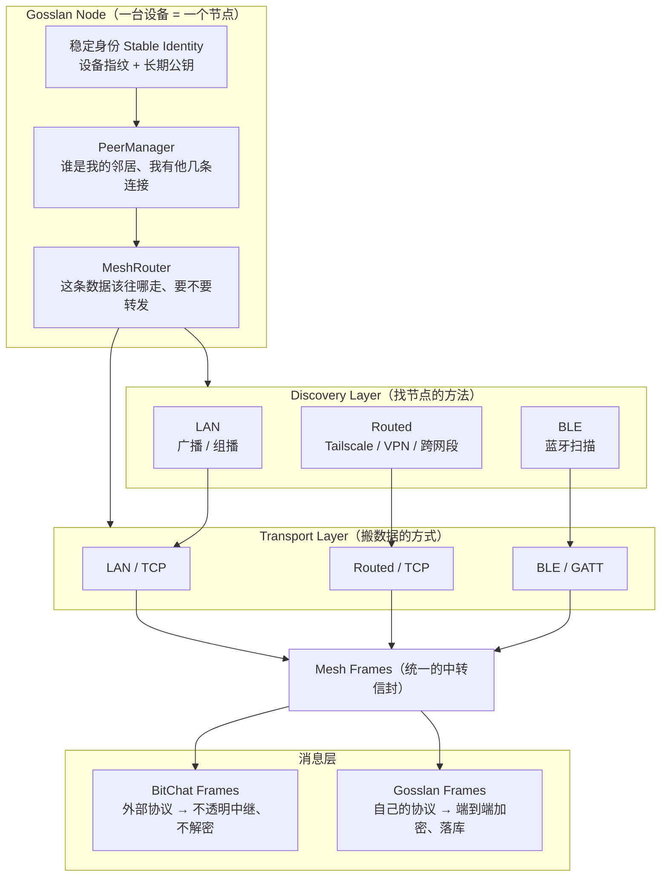
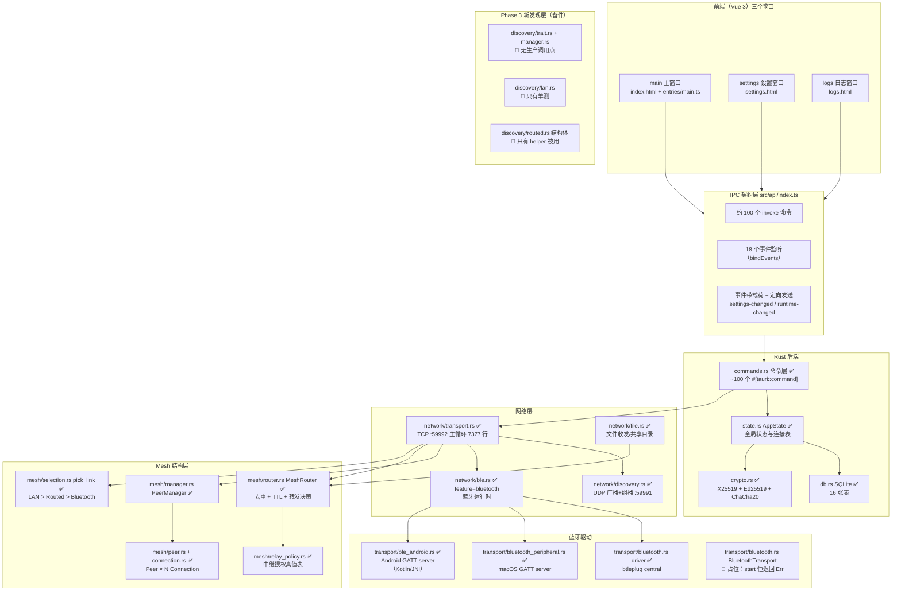
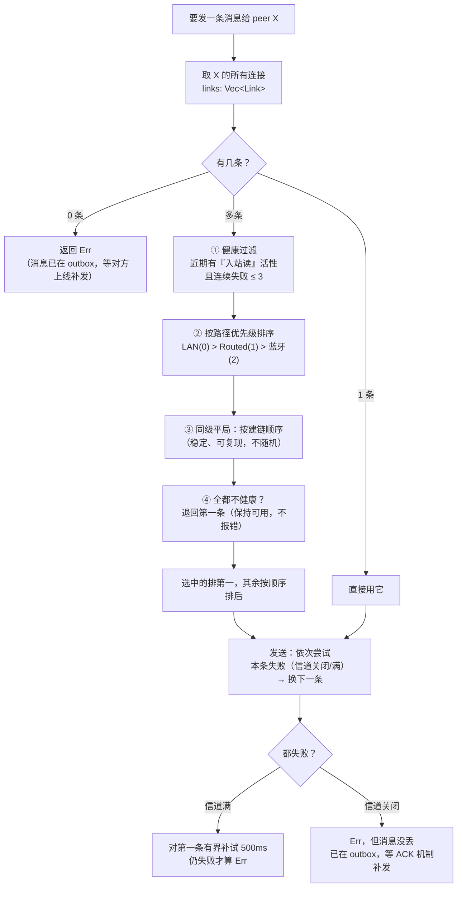
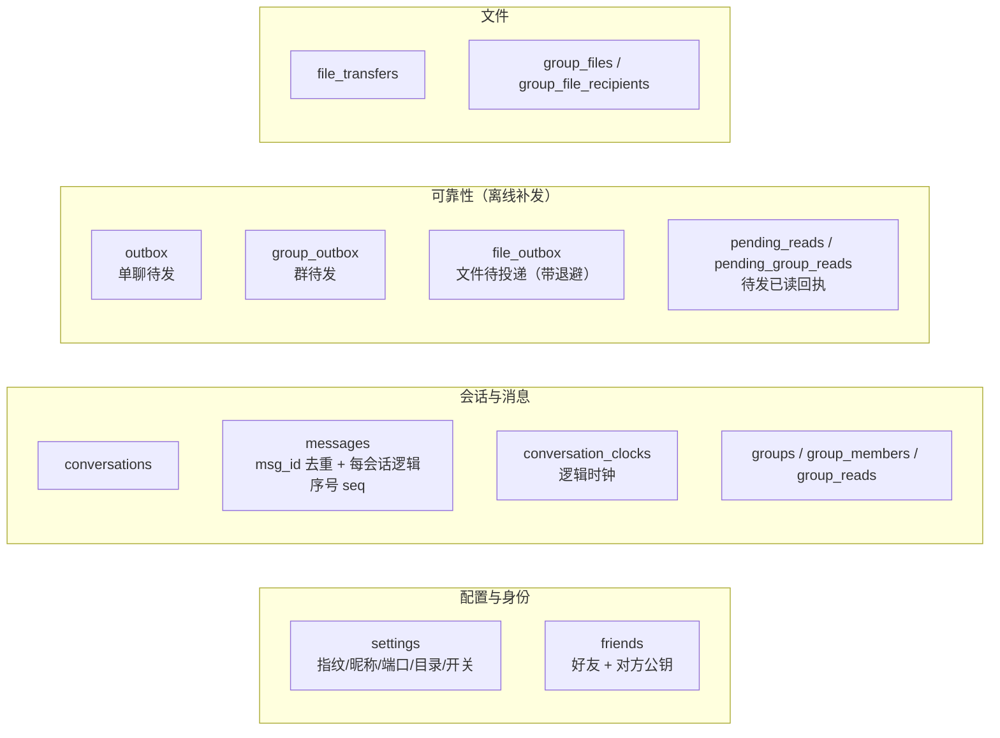

# Gosslan 架构图解（新人版）

> **这份文档写给谁看**：刚接手这个仓库、或者刚学编程不久的人。目标是不看代码就能
> 明白「这东西由哪些部分组成、每部分用了什么技术、设备之间怎么连、优先级怎么排、
> 现在做到哪一步了」。
>
> **快照基线（重要）**：`next @ d4bc437` · v4.2.7 · 2026-09-12 21:23；
> **2026-09-13 晚复核到 `next @ 4.3.7`**（Windows 那一侧被 rebase 进来，
> 蓝牙三端都补齐了：见下面 §3.1 与 §4.1 的"Windows 外设"）。
> 这个仓库**正被另一个会话同时开发**，所以文件行号、模块清单会漂移；
> **结论性的架构关系比行号稳定**。
>
> **图怎么看**：下面所有架构图都是 [Mermaid](https://mermaid.js.org/) 文本图。
> GitHub、VS Code、Zed、Typora 打开这个文件会自动渲染成图。

---

## 0. 先用一句话理解这个项目

**Gosslan = 一个没有服务器的局域网 / 蓝牙即时通讯软件（Windows / macOS / Android）。**

| | 微信 / 钉钉 | Gosslan |
|---|---|---|
| 消息经过哪 | 腾讯/阿里的服务器 | **设备直连设备**（同一个 Wi-Fi 下直接 TCP） |
| 要有账号吗 | 要，手机号注册 | **不要**，靠设备指纹互相认识 |
| 服务器能看到内容吗 | 能（所以要端到端加密） | 根本没有服务器 |
| 不在同一个网能聊吗 | 能 | 默认不能；可手填 Tailscale/VPN 地址，或走蓝牙、走别人的设备中转 |

打个比方：微信是**打总机转接**，Gosslan 是**对讲机**——互相能听见就直接喊；
听不见就找人**帮忙传话**（中继），或者换一种喊法（蓝牙）。

---

## 1. 技术栈速查表：哪一层用了什么

初级程序员最容易迷失在"这么多名词"。这张表每个技术都给一句人话解释。

| 层 / 部分 | 用了什么技术 | 它是干嘛的（人话） |
|---|---|---|
| **界面（UI）** | **Vue 3 + TypeScript** | 写页面的框架；TS 是"带类型的 JS"，帮你少写 bug |
| | **Vite** | 打包工具，把 `.vue` 源码编译成浏览器能跑的文件 |
| | **Tailwind CSS 3** | 不用写 CSS 文件，直接在 class 里写样式（`class="flex p-2"`） |
| | **Pinia** | Vue 的"全局状态仓库"：数据放这里，哪个页面都能读 |
| | **Headless UI** | 无样式的弹窗/抽屉组件（只有行为，样式自己写） |
| | **lucide-vue-next** | 图标库（34 处用到） |
| | **highlight.js** | 代码高亮，**只用在一个组件** `CodeBlock.vue` |
| | **dayjs** | 时间格式化 |
| **桌面壳（容器的壳）** | **Tauri v2** | 把网页装进一个原生窗口里，并且让网页能调用 Rust 函数 |
| | tauri 插件：`dialog` / `opener` / `notification` | 选文件对话框 / 用系统默认程序打开文件 / 系统通知 |
| **后端内核** | **Rust（2021 edition）** | 真正干活的：网络、数据库、加密都在这里 |
| | **tokio** | Rust 的异步运行时（同时处理很多连接靠它） |
| | **serde / serde_json** | 结构体 ↔ JSON 互转（前后端通信靠它） |
| | **rusqlite（bundled）** | SQLite 数据库，编译进程序里，用户不用装 |
| | **socket2 / if-addrs** | 底层 socket 选项、枚举本机网卡 |
| **加密** | **x25519-dalek** | 密钥交换：两边各出半把钥匙，拼出同一把共享钥匙 |
| | **ed25519-dalek** | 数字签名：证明"这条消息确实是我发的" |
| | **chacha20poly1305** | 对称加密：用共享钥匙把内容锁起来（还能防篡改） |
| | sha2 / base64 | 哈希算消息 ID / 把二进制转成文本传输 |
| **发现（怎么找到对方）** | UDP **广播** + UDP **组播**（端口 `59991`） | 往局域网里"喊一嗓子"：谁在？ |
| | **手动端点（Routed）** | 手填对方 IP（Tailscale/VPN/跨网段时用） |
| **传输（怎么传数据）** | **TCP**（端口 `59992`） | 真正搬消息和文件的通道 |
| | 自定义分帧：**4 字节大端长度 + JSON** | TCP 是字节流，得自己定"一条消息到哪结束" |
| **蓝牙** | **btleplug 0.13**（central 角色；`vendor/btleplug` 是本地打补丁的副本，只改了 Windows 路径） | 跨平台蓝牙库：去"扫描/连接"别的设备；**外设（GATT server）角色**三端各自用原生 API：macOS `objc2-core-bluetooth`、Android Kotlin + JNI、Windows WinRT `GattServiceProvider` |
| | **objc2-core-bluetooth**（macOS 外设） | macOS 上当"被连接"的那一方 |
| | **Kotlin + JNI**（Android 外设） | 安卓上当外设；Rust ↔ Kotlin 用 JNI 互调 |
| **Android 桥** | `jni 0.22` + Kotlin 文件 | Rust 和安卓系统 API 之间的翻译层 |
| **测试** | `node:test`（37 个前端测试文件）、`cargo test --lib`、`scripts/verify-guards.py` | 见 §9 |

---

## 2. 图 A：**期望的**架构（目标形态）

这是项目自己的设计总纲（`.workbuddy/mesh-task/混合 mesh的总指令和目标.md` §1 / §66）定下的目标。
一句话原则：

> **Node 是节点。Transport 是连接方式。Discovery 是寻找节点的方法。Router 是决定数据往哪里走的方法。**



**怎么读这张图**：
- 中间那个 `Gosslan Node` 是"不变的核心"：一台设备**永远只有一个身份**，
  不管它是通过 Wi-Fi 还是蓝牙连上来的（这条叫 `P-A02 / ADR-0014`：**Peer 与 Connection 分离**）。
- 左边 Discovery 只负责"发现人"，**不许负责"连人"**（设计总纲 §5 的硬规矩）。
- 右边 Transport 只负责"搬字节"，**不许理解消息内容**（§11）。
- 底下 `Mesh Frames` 是分水岭：**自己的消息要解密**，**别人的消息只是帮转**（§29/§30）。

### 2.1 目标里的八层（每层只干一件事）

设计总纲把系统切成 8 层 + 2 条横切。**注意：这是"职责边界"，不是目录名**——
比如 `Transport` 绝不允许理解消息内容（§11），`Discovery` 绝不允许负责建连（§5）。

| 层 | 只负责什么 | 关键概念 | 总纲 |
|---|---|---|---|
| L7 应用 / UI | 聊天、好友、群、文件、设置、诊断面板 | 聊天界面、拓扑诊断视图 | §41 §45 §46 §61 |
| L6 命令与状态 | Tauri 命令 + `AppState` + 窗口/IPC 事件 | `commands.rs`、`state.rs` | — |
| L5 消息与会话 | **可靠性语义**：msg_id、Outbox、ACK、已读、文件 | Reliable Message、`Message`、`GossipEnvelope` | §12 §21 |
| L4 路由与 Mesh | 收 → 验帧 → 去重 → TTL → 定目的 → **选连接** → 转发 | MeshRouter、MeshFrame、Dedup、Fanout | §13–§20 §39–§44 |
| L3 传输 | **只搬字节**：连接、发、收 | TransportManager、TCP、BLE | §10 §11 §27 §37 |
| L2 发现 | **只回答"谁存在"**，产出候选，不建连 | DiscoveryManager、PeerCandidate | §5–§9 §36 |
| L1 设备与身份 | 稳定身份 + Peer/Connection 聚合 + 在线判定 | Node/Peer/Connection/Endpoint/health | §2–§4 §31–§35 |
| L0 存储 | 会话/好友/文件落 SQLite；**中继帧不落库** | SQLite、store-and-forward | §44 |
| 横切 | 安全、抗 DoS、可观测、测试、不可变契约 | 不解密、各种上限、6 张测试拓扑 | §42 §43 §45–§48 |

**目标里的选路策略（§19）**：先按来源/TTL/重复/能力/背压**过滤候选**，再**评分选一条**
（评分因子：可靠性 + 延迟 + 带宽 + 电量 + 成本）。但总纲同时明确：
**第一版不要做过度智能化**，§20 只要求三种策略——直连 peer 挑最好一条、Gossip 用有界 fanout、
Relay 转发给其他 peer，**不实现最短路径算法**。今天代码里的实现正是这个"第一版"。

---

## 3. 图 B：**现状**架构（代码里真的长这样）

同一张目标图的"实际施工进度"版本。标注含义：

- ✅ **已接线**：有真实调用点，跑得起来
- ⚠️ **部分/半接线**：结构在、主路径接了，但有分支还没接
- 🧩 **已实现、未接线**：代码写好了但没人调用（等于备件）



**和"期望"的差距**（就是"到哪一步了"的关键）：
1. **Phase 3 的独立发现层整套是备件**——真正跑的还是老的 `network/discovery.rs`。
2. **`BluetoothTransport` 是占位**（`start()` 永远返回错误）——真正在跑的是 `network/ble.rs`。
3. **广播选路还没接**：`broadcast_gossip` 仍取每个 peer 的"第一条连接"，
   而定向消息已经走 `pick_link` 优先级（代码注释明写"留到 M3-d"）。
4. **文件中继的发送侧是备件**：`file_relay.rs` 的分片/发送函数没人调用，
   只有"接收侧重组"接了线。

### 3.1 三端差异：同一套代码，三份"平台特供"

界面和网络核心是三端共用的；差异全部通过 **Cargo 的 `target` 门控**和 **`#[cfg(desktop)] / #[cfg(mobile)]`**
隔离——**Android 编译不会把桌面托盘代码编译进去**，反之亦然。

| 平台 | 专属能力（代码位置） | 权限 / 打包产物 |
|---|---|---|
| **macOS** | 原生菜单栏（`menu.rs`）、沙盒安全书签（`macos_bookmark.rs`，记住用户授权的目录）、窗口圆角（`macos_window.rs`）、**蓝牙外设角色**（`bluetooth_peripheral.rs`，用 objc2-core-bluetooth） | 无需特殊权限声明；产物 `.dmg` / `.app` |
| **Windows** | 剪贴板复制**文件本体**（`clipboard-win`，CF_HDROP）、便携版打包、**蓝牙外设角色**（`bluetooth_peripheral_windows.rs`，用 WinRT `GattServiceProvider`；2026-09-13 补齐，见 ADR-0015 §7.10） | 产物 NSIS `.exe` / `.msi` / portable `.zip` |
| **Android** | **Kotlin 三个自研文件**：`MainActivity.kt`（入口 + 权限申请）、`BlePeripheral.kt`（GATT server）、`OpenWith.kt`（FileProvider 打开收到的文件）；Rust↔Kotlin 用 **JNI**（`jni_method.rs` 宏登记签名，有护栏防止 Rust 与 Kotlin 签名不一致） | 声明 10 个权限（BLUETOOTH_SCAN/CONNECT/ADVERTISE、NEARBY_WIFI_DEVICES、ACCESS_FINE_LOCATION、CHANGE_WIFI_MULTICAST_STATE、INTERNET、VIBRATE…）；产物 4 ABI 的 APK |
| **三端都有的差异开关** | 蓝牙代码在 Cargo feature `bluetooth` 后面（**默认关闭**，发布构建才开）；`machine-uid` 只给桌面（Android 编译不过） | 不开 feature 时：依赖不下载、代码不编译、**行为与没有蓝牙完全一致** |

**跨语言护栏**（值得学的做法）：Rust 调 Kotlin 的每个方法都登记在 `jni_method.rs`，
`verify-guards.py` 会检查 Rust 描述的签名（如 `stop` 是 `()V`）与 Kotlin 实际声明是否一致——
**JNI 不做编译期检查，写错只在真机崩**，所以把检查搬到了测试里。

**CI**：`.github/workflows/` 三个 workflow（`build.yml` 桌面、`build-android.yml`、`build-macos.yml`），
由 tag 触发并自动创建 Release（apk / dmg / exe 三件套）。

### 3.2 Android 上踩过的三个真坑（对新人最有价值的部分）

这个项目的 Android 代码量不大，但**每一个坑都是真机上血泪换来的**，值得单独看：

| 坑 | 现象 | 真因 | 修法 |
|---|---|---|---|
| **WiFi 驱动丢组播帧** | 同一个 WiFi 下互相搜不到 | Android 为省电，默认**丢弃组播帧** | `LanMulticast.kt` 在前台期持有 `WifiManager.MulticastLock` |
| **JNI 跨语言签名对不上** | 真机直接 SIGABRT / `NoSuchMethodError`，logcat 什么都没有 | JNI **不做编译期检查**；`nativeAttachOpenWith` 少写 `static` 就被注册成实例方法 | 所有方法登记进 `jni_method.rs`，由 `verify-guards.py` 比对 Rust 描述与 Kotlin 声明；`@JvmStatic` 也在护栏里 |
| **R8 把要用的东西删了** | release 包蓝牙全废，debug 包正常 | ① 只 keep 实例方法 ⇒ 静态桥被删（`Method not found: start ()Z`）；② btleplug 依赖里的包名被拼错成 `gedgygeddy` ⇒ 整包被删且 `-dontwarn` 吞掉警告 | `proguard-gosslan.pro` 显式 keep 三类：`BlePeripheral` 静态方法、`OpenWith`、`com.nonpolynomial.**` 与 `io.github.gedgygedgy.**`；构建后反查 dex 断言两个包都在 |

> 📌 **一条通用经验**：`panic = "abort"`、JNI、R8 这三样组合起来，会让 Android 上的错误
> **"什么都不打印直接消失"**。所以这个项目的 Android 排查**极度依赖 logcat + logcat 镜像**，
> 相关修复大多是从 logcat 里找到真因的（4.1.4 → 4.1.17 一整串都是这么修的）。

---

## 4. 图 C：连接优先级（**这是你最关心的部分**）

### 4.1 一共有几种"连法"

| 通道 | 端口 / 标识 | 干什么 | 什么时候用 | 现在状态 |
|---|---|---|---|---|
| UDP 广播发现 | `59991`，`255.255.255.255` | 同网段"喊一嗓子"找人 | 默认，5 秒一轮 | ✅ 已接线 |
| UDP 组播发现 | `239.255.42.99:59991` | 广播被路由器拦了时的备选 | 同上 | ✅ 已接线 |
| TCP 直连 | `59992` | **所有消息和文件的真正通道** | 同网段 | ✅ 主路径 |
| Routed（跨网段） | 同一个 `59992`，手填 IP | 经 Tailscale / VPN / 跨子网 | 用户手填地址 | ✅ 已接线 |
| 蓝牙 BLE | GATT 服务 `6b1a7e60-…-1e5f7a9d0c31` | 没有 Wi-Fi 时直连 | 手机 ↔ 电脑 | ✅ 已接线（feature 默认关，发布版开） |
| TCP 中继（多跳） | `RelayChunk` 消息 | A 和 C 连不上时，让 B 转 | 跨跳消息/文件 | ✅ 已接线（fanout 4、ttl ≤ 6） |
| Mesh 外部帧 | `Message::OpaqueExternal` | 帮**别的协议**（如 BitChat）转发 | 异构 mesh 互通 | ✅ 已接线（不解密、不落库） |

### 4.2 一条消息要发出去时，怎么挑链路（**优先级 = LAN > Routed > 蓝牙**）



**关键设计决定（都是写进 ADR 的，别乱改）**：

> **与目标的差距**：设计总纲 §19 的目标是"**过滤 → 评分 → 选一条**"（评分含延迟/带宽/电量）；
> 今天实现的是**第一版**：过滤（健康）→ 固定优先级 → 平局按建链顺序。总纲 §20 明确
> "不实现最短路径、不做过度智能化"，所以这不是欠账，是**刻意的分阶段**。

| 决定 | 为什么这么定 |
|---|---|
| **优先级是固定的 LAN > Routed > 蓝牙**，不按延迟排序 | 项目**故意不做 RTT**（要测延迟就得给心跳加回包 = 改协议，三端同步升级）。LAN 和 Tailscale 的延迟差几个数量级，固定优先级已经够用（ADR-0014 §2） |
| **"健康"看的是"最近读到过帧"**，不是"写成功" | 踩过的坑：对端进程已经死了、本机内核还收写 ⇒ 写一直"成功"，链路永远"健康"，消息被投进死路。所以健康拆成"读活性/写活性"两个字段（M3-0b） |
| **全都不健康时退回第一条**，而不是报错 | "保持可用"比"报错"好；也和改造前的老行为一致 |
| **谁主动拨号 = device_id 字典序** | 两边同时拨会撞车。约定：id 大的一方先拨；小的一方等 10 秒兜底。同一条 LAN 路径已通就不再拨（防重复连接） |
| **同一个 peer 可以同时有多条连接** | 断一条不影响另一条（Phase 6 的成果：LAN + Tailscale 共存） |

### 4.3 失败之后怎么降级（从轻到重）

1. **这条连接的信道关了** → 立刻换下一条连接试（连接级 failover）
2. **信道满了**（对端一时消费不过来）→ 换下一条；全满则对第一条等 500ms 再试，超时才算失败
3. **写失败** → 标记这条连接失败，写循环退出；已读回执先存起来等补发
4. **读循环退出** → 只摘掉**这一条**链路，同一个 peer 的其他链路保留；全断了才算对方离线
5. **静默半开**（对端消失、本机还以为连着）→ 心跳每 5 秒检查，**读活性超过 3×15s = 45 秒**判定这条链路死了，取消它的读写任务并移出连接表
6. **重拨** → 下一轮 UDP announce（≤5 秒）时重新建链
7. **跨跳补发** → 靠 TTL 递减转发；离线判定阈值 45 秒

### 4.4 传输队列也有优先级（防"发文件卡死聊天"）

每条 TCP 连接内部其实有**两条队列**（各 1024 容量）：

| 队列 | 装什么 | 谁排队 |
|---|---|---|
| **priority**（优先） | 聊天消息、Gossip、ACK、已读回执、心跳、握手、控制帧 | 先被消费 |
| **bulk**（大宗） | 文件分片（`FileChunk` / `GroupFileChunk` / `RelayChunk` / `FileDone`） | 后消费 |

写循环用 Rust 的 `biased select` **固定优先**读 priority，这就是"聊天永不被文件饿死"的实现
（不变量 `INV-P20`）。注意 `FileDone` 必须和分片同队列，否则顺序会乱。

---

## 5. 图 D：一条消息的完整旅程

```mermaid
sequenceDiagram
    autonumber
    participant U as 用户
    participant V as Vue 前端
    participant R as Rust commands.rs
    participant DB as SQLite
    participant T as TCP 连接（priority 队列）
    participant P as 对方 Rust
    participant PD as 对方 SQLite

    U->>V: 输入文字，回车
    V->>V: 乐观上屏（状态=发送中，临时 id）
    V->>R: invoke send_message
    R->>DB: 事务：写 messages + 写 outbox
    Note over R,DB: 先落库再发送（INV-P04）<br/>socket 写成功 ≠ 送达
    R->>R: 取对方 X25519 公钥 → 派生共享密钥
    R->>R: ChaCha20-Poly1305 加密，加 enc1: 前缀
    R->>R: pick_link 选链路（LAN > Routed &gt; 蓝牙）
    R->>T: 写帧（4 字节长度 + JSON）
    T->>P: TCP 字节流
    P->>P: 验签 + 解密（失败则不落库、不回 ACK）
    P->>PD: 按 msg_id 幂等落库
    P->>T: 回 Ack
    T->>R: 收到 Ack
    R->>DB: 删除 outbox 行（只有 ACK 才删）
    R->>V: 事件 message-acked
    V->>V: 状态：发送中 → 已送达（空心圆）
    Note over U,V: 对方打开会话 → 回执 → 变绿勾（已读）
```

**广播型消息（Gossip）走的是另一条路**：不针对单个 peer，而是按 fanout=4 泛洪、TTL ≤ 6 递减、
用 Bloom Filter + LRU 去重（`gossip_engine.rs`）。**收到重复消息只回 ACK、不重复入库**——
这条叫 `INV-P02` 幂等，是全项目最重要的一条纪律。

---

## 6. 图 E：数据放在哪（SQLite 16 张表）

**没有云端，所有数据只在本机**。按用途分四组：



> ✅ **这处文档漂移已消除（2026-09-26）**：那份手写的 `src-tauri/src/schema.sql` 已**退役删除**，
> 表结构的唯一真源是 `db.rs` 的 `SCHEMA` 常量。原先的问题不是"少了几张表"本身，而是
> **它自称与 `db.rs` 一致、却没有一行代码读它** —— 一致性完全靠人记得，于是"描述了漂移的那句文档
> 自己也漂了"（这一度写着"缺两表"，实测是四张）。

---

## 7. 现在做到哪一步了

### 7.1 设计总纲的 12 个 Phase（长期蓝图）

| Phase | 主题 | 状态（依据代码 + 设计文档原始标注） |
|---|---|---|
| 0 | Architecture Audit（只读盘点） | ✅ 已做 |
| 1 | 统一网络模型（Peer / Connection / Endpoint / Path） | ✅ 已落地（`mesh/peer.rs`、`connection.rs`、`endpoint.rs`、`path.rs`） |
| 2 | PeerManager（一个 peer 多条连接） | ✅ 已接线（`state.rs` 持有，`transport.rs` 调用） |
| 3 | DiscoveryManager（发现层独立） | 🧩 **实现完成但未接线**（仍走老的 `network/discovery.rs`） |
| 4 | TCP Transport 重构 | ✅ 已落地 |
| 5 | MeshRouter（去重 + TTL + 转发） | ✅ 已接线（`state.rs` 持有，`transport.rs` 调用） |
| 6 | 双路径验证（LAN + Routed 共存 + 选路） | ✅ **完成**（含真机 A↔B↔C 双连接验证） |
| 7 | BLE Transport | ✅ 主体完成（central + macOS/Android 外设已接线）；**两处平台缺口**：iOS 外设（需 Xcode，后裁决停做）、Windows 外设（WinRT 无现成实现）；**真机端到端待测** |
| 8 | BitChat Packet Engine（外部帧中继） | ✅ **已落地**（round 20，三条验收各有护栏，`cargo 395/0`，随 **4.0.0** 发布） |
| 9 | BLE → BLE Relay | ⬜ 未见实现 |
| 10 | Heterogeneous Mesh（BLE↔LAN 异构网关） | ⬜ 未见实现 |
| 11 | Route Quality（选路质量，评分制） | ⬜ 明确"当前不做 RTT" |
| 12 | UI / 诊断视图 | ⚠️ 部分（有 `get_topology`、诊断面板、链路徽标） |

### 7.2 网络层里程碑 M2 / M3 / M4（**跟"连接优先级"直接相关**）

| 里程碑 | 内容 | 状态 |
|---|---|---|
| **M2** | 双向建链兜底：大 ID 立即拨、小 ID 延迟 10s 兜底（解决"单向可达"） | ✅ 完成 |
| **M3-0 / 0b** | 健康信号接入 → **拆成读活性 / 写活性**（治半开链路"永久健康"） | ✅ 完成 |
| **M3-a** | `pick_link` 纯函数 + 单测（行为零变化，便于二分定位） | ✅ 完成 |
| **M3-b** | `try_send` 接线选路 + 锁内快照/锁外发送 | ✅ 完成 |
| **M3-c** | 原计划"连续失败 N 次摘链路" | ⚠️ **改判**：该判据在本设计里不可达，改由**读活性超时拆除**承担（45s） |
| **M3-d** | `broadcast_gossip` 也走选路 | ⬜ **未做**（仍取每个 peer 第一条连接） |
| **M3-e** | 可观测性（`[mesh] route` 日志）+ 链路徽标语义校正 | ⚠️ 徽标语义已修（`best_link_kind`）；route 日志未确认 |
| **M4** | 中继授权 `off / friends / allowlist / all` + 设置页（ADR-0016） | ✅ 已接线；⚠️ **设计与实现默认值不一致**（设计要 `off`，实现是 `all`） |


### 7.3 明确"还没接线"的备件清单（4 处）

| 备件 | 位置 | 影响 |
|---|---|---|
| `BluetoothTransport`（`start()` 恒返回 Err） | `transport/bluetooth.rs` | 无害：真正在跑的是 `network/ble.rs` |
| Phase 3 整套发现层（trait / manager / lan / routed 结构体） | `discovery/` | 老路径还能用；这是"将来换引擎"的准备 |
| `file_relay.rs` 的**发送侧**（分片/登记/取片/ACK） | `file_relay.rs` | 接收侧重组已接线；发送侧目前没人调用 |
| `broadcast_gossip` 未用 `pick_link` | `network/transport.rs` | 广播仍取每个 peer 的第一条连接（注释明写待 M3-d） |

### 7.4 文档与代码的漂移（接手前必看）

| 文档 | 问题 |
|---|---|
| `AI_PROJECT_HANDOFF.md` | 停在 **v1.0.0**（2026-09-08），完全没写 mesh / BLE / 中继 / 多路径选路 / 一窗一入口 |
| `docs/acceptance/1.0-release.md` | 写着"不要实现蓝牙、跨子网、Mesh 优化"——**当时的结论已被后续需求推翻** |
| ~~`src-tauri/src/schema.sql`~~ | **已退役删除（2026-09-26）**。表结构只看 `db.rs` 的 `SCHEMA` 一份 ⇒ 见 §12.8：真正的病灶不是"少几张表"，是**一份自称是事实源、却没有任何代码读它**的 DDL |
| `docs/adr/0014`–`0017` 头部 | 标注仍是 Proposed/Accepted，与实际落地进度不同步 |
| `P2-P3-开发计划.md` | **同一个文件内 Phase 7/8 前后矛盾**：§8.1 写"已授权可开工"，§12 写"已落地" |
| `mesh-architecture-evolution.md` | M3 状态过期（一处写"进行中/M3-b 是下一步"，后文已写全部完成）；旧文"Gossip 是单跳"也已标注为过时 |
| **M4 默认值** | 设计要 `off`（更安全），实现是 `all`（与旧行为一致）——**这是一处需要产品决策的冲突** |
| **M1 里程碑** | 在 mesh 体系里**从未定义**，且与 `artifacts/` 里另一套 M1 编号撞名 |

### 7.5 红线：这些东西不许动（改代码前先看）

这些是项目自己列的"工程宪法"（设计总纲 §8.1 #1–#11 + 前言四条），**违反会造成静默故障**：

1. 不许改 **Frozen Core** 的语义：msg_id / E2EE / Outbox / ACK / 消息状态 / 好友关系 / 文件持久化 / 通知 / 聊天 UI
2. 不许并行双绑同一个 UDP 端口（会搞坏现有发现）
3. 不许在重构里**顺手改变传播语义**
4. 同 endpoint 的 `upsert_connection` **绝不能覆盖 health**（会导致该连接永远"从未成功"→ 永远离线）
5. **源发广播禁止用 fanout 截断**（会静默漏发群消息）
6. 新路径稳定前，不许删 `state.links` / `state.peers` / `network::discovery`
7. 一个 commit 只做一件事（不许一次改几十个文件）
8. 不许 `git add -A`（必须显式列路径）
9. 不许把 `.workbuddy/` 内部文档提交进仓库
10. 没明确指示**不许 `git push`**
11. 不许为"未来可能支持"提前加抽象（YAGNI：Dijkstra / AODV / 复杂 DHT 明确不做）

外加三条边界：**不解密 BitChat 私聊**、**中继包不进 SQLite**、**不复制 BitChat 的消息/身份/频道/UI/DB 设计**。

### 7.6 版本进度时间线（怎么从"局域网聊天"长成"异构 mesh"）

| 版本 | 主题 | 关键增量 |
|---|---|---|
| 0.1–0.3 | 骨架 | UDP 发现 + TCP 分帧 + 好友/群/文件/共享目录；0.2 加入 **E2EE + Gossip 泛洪 + 大文件切片中继**；0.3 加入按需探测、Transport 抽象、**mesh 中继路由** |
| 0.4–0.8 | 可靠性 | outbox + **ACK 才删行**、心跳探活；0.5 **虚拟滚动**；0.6 回执链路（转圈 → 空心圆 → 绿勾）；0.8 直发加密 `enc1:`、指纹前缀 `gosslan-` |
| 0.9–1.2 | 产品化 | 系统托盘；**E2EE 恒开**；桌面默认联网；**1.0.0**：群/文件离线补发、Lamport 逻辑序号、bulk/priority 双队列；1.1 夜间模式 + 图片移出 SQLite；1.2 表情与相册 |
| 2.x | 安全 + Apple HIG | **2.0.0 握手签名 + 防重放（破坏性：与 1.x 不互通）**；2.1 四批 HIG 改造（原生菜单栏、外观/语言三态、i18n 全量、触觉、隐私清单） |
| **3.0.0** | **网络层 + 蓝牙** | Phase 6 双路径；连接健康拆读/写活性；**多路径选路 `pick_link`（LAN > Routed > 蓝牙）**；**BLE 全套**（macOS 外设 + Android `BlePeripheral` + JNI 桥）；三窗口彻底分离；无障碍护栏 |
| **4.0.0** | **外部 mesh** | Phase 8：`OpaqueExternal` 帧经 MeshRouter 去重 + TTL 递减 + 源节点排除后转发；**不解密、不落库、不进 gossip** |
| 4.1.x | 排障 + 窗口架构 | logcat 驱动的连环真机修复（非主线程调 framework、droidplug 未初始化、包名拼错、JNI static、R8 keep、蓝牙启停抖动、`content://` 导入）；`settings-changed` 带补丁；运行状态合并为单一快照 |
| **4.2.x** | BLE 收尾 | 扫描结果被 `services()` 过滤掉、平台级服务过滤差异、**镜像互拨打断链路**、在线语义改为 `present = 任一通道在跑`；ADR-0018 窗口架构 |

**"这功能多久了"速查**：

| 功能 | 引入版本 |
|---|---|
| mesh / 中继路由 | 0.3.0 |
| 虚拟滚动（`VirtualList`） | 0.5.0 |
| 传收优先级双队列 | 1.0.0（ADR-0013） |
| 握手签名 / 防重放 | 2.0.0（ADR-0011） |
| **多路径选路 `pick_link`** | **3.0.0（ADR-0014，优先级至今未变）** |
| BLE 传输全栈 | 3.0.0（ADR-0015） |
| 中继授权 | 3.0.0（ADR-0016） |
| 外部 mesh 不透明帧 | 4.0.0（ADR-0017） |
| 窗口架构（一窗一入口） | 4.2.x（ADR-0018） |

> 📌 快照时 `CHANGELOG.md` 的 `[Unreleased]` 里还有 **3 条"已实现但未发版"**的改动
> （安卓非聊天页不判已读、"蓝牙直连"不再用"没有 IP"反推、会话列表不随输入变化）——
> 所以 **代码比版本号更新**，看状态时别只看 `package.json`。
>
> ⚠️ **没有的东西别去找**：仓库里**不存在 Baseline Profile / Macrobenchmark / profileinstaller**；
> 性能验证靠 `perf/` 下的手写压测台（用真实 `VirtualList` 灌 5 万 / 10 万条消息），
> 其 README 自述当前 `virtualizationOK: false` —— **性能这条线还没收口**。

---

## 8. 术语表（看代码时对照）

| 术语 | 人话解释 |
|---|---|
| **Peer（节点）** | 一台设备（一个身份）。**不是**一条连接 |
| **Connection / Link** | 一条具体连接。一个 Peer 可以有多条（LAN 一条、Tailscale 一条） |
| **Endpoint** | 连接的地址：TCP 是 `IP:端口`，蓝牙是 `BLE 端点` |
| **PathKind** | 这条连接属于哪类路径：`Lan` / `Routed` / `Bluetooth` |
| **Discovery** | "怎么找到别人"，只产候选，不负责建连 |
| **Transport** | "怎么搬字节"，不理解消息内容 |
| **MeshRouter** | "这条数据该往哪走、要不要帮别人转" |
| **Gossip** | 广播式扩散：一个人告诉几个人，几个人再告诉更多人 |
| **Fanout** | 一轮转发给几个邻居（现在 4 个） |
| **TTL** | 还能被转发几次，每转一次减 1，减到 0 就停（防无限流传） |
| **Envelope（信封）** | 消息外面的元数据壳：谁发的、签名、是否加密、消息 ID |
| **msg_id** | 消息的身份证。**去重、幂等、ACK 全靠它** |
| **Outbox** | "发件箱"：消息先存这里，收到 ACK 才删（防止静默丢消息） |
| **ACK** | "我收到了"的确认回执；**socket 写成功不算送达** |
| **seq（逻辑序号）** | 不依赖墙上时钟的排序号，保证两台设备的消息顺序一致 |
| **E2EE** | 端到端加密：只有收发双方能看懂 |
| **TOFU** | 第一次见到公钥就信任（没有权威机构，先信后验） |
| **Routed** | 跨子网/VPN/Tailscale 的 IP 路径 |
| **OpaqueExternal** | 帮别的协议转发的帧：**只转不看**，不解密不落库 |
| **Nonce** | 一次性随机数，防止重放攻击 |
| **半开连接** | 对面已经没了，本机还以为连着（靠"读活性"发现） |

---

## 9. 想自己验证？几条命令

```bash
# 前端纯逻辑测试（37 个文件）
npm test

# Rust 单元测试
cd src-tauri && cargo test --lib

# 护栏"非空转"验证：故意改坏源码，断言测试必须失败，再恢复
python3 scripts/verify-guards.py            # 全部（含 Rust，约 10 分钟）
python3 scripts/verify-guards.py --only frontend   # 只跑前端（十几秒）
python3 scripts/verify-guards.py --list     # 只列用例

# 版本号规则 + CHANGELOG 结构
npm run version:check
```

> 这个项目有一条特别值得学的纪律：**每加一条测试，都要证明"改坏它就会失败"**。
> `scripts/verify-guards.py` 就是自动做这件事的（改坏 → 必须 FAIL → 恢复 → 必须 PASS）。
> 这也是为什么上面那些"红线/不变量"能一直守住。

---

## 10. 新人上手路线（先跑起来，再按顺序读代码）

### 10.1 跑起来（macOS / Linux）

```bash
npm install
npm run tauri dev          # 开发模式：Vue 热更新 + Rust 编译
```

想**一台机器模拟多个节点**（调试网络最有用）：用 `--instance N` 参数开多个实例，
每个实例有独立的数据库、TCP 端口和指纹，UDP 发现共享（`README` §多开）。

### 10.2 建议的代码阅读顺序（由外向内）

| 顺序 | 读什么 | 为什么先读它 |
|---|---|---|
| 1 | `src/entries/main.ts` → `src/App.vue` | 看清"应用从哪启动、页面怎么组织" |
| 2 | `src/api/index.ts` | **一页看完前后端所有接口**（约 100 个 invoke + 18 个事件）——最高性价比 |
| 3 | `src/stores/useAppStore.ts` / `useChatStore.ts` | 前端状态都在这里；两个 store 的边界很干净 |
| 4 | `src-tauri/src/lib.rs` | Rust 侧的总装配：注册了哪些命令、启动了哪些后台任务 |
| 5 | `src-tauri/src/commands.rs` | 前端每个 invoke 对应的 Rust 实现 |
| 6 | `src-tauri/src/state.rs` | 全局状态 `AppState`：连接表、待发队列、锁都在这里 |
| 7 | `src-tauri/src/network/transport.rs` | **核心中的核心**：TCP 收发主循环、选路、补发（7000+ 行，别一次读完） |
| 8 | `src-tauri/src/mesh/selection.rs` | 只有 200 行，但决定了"走哪条链路"，最好读的一个策略文件 |
| 9 | `docs/protocol-invariants.md` | 21 条不变量（INV-P01…P21）：**改网络代码前必须读** |
| 10 | `docs/adr/0013` / `0014` | 队列优先级 与 多路径选路的完整推理过程 |

> 💡 **省时间技巧**：真正难懂的只有两件事——「**消息怎么保证不丢**」（Outbox + ACK + 幂等）
> 和「**多条链路怎么选**」（健康 + 优先级 + failover）。把这两条主线抓住，其余都是外围。

---

## 11. 一句话总结

> **期望**：一个拥有稳定身份、统一 Peer Graph、统一 Mesh Router 的去中心化节点，
> LAN / Routed / 蓝牙都只是它可以用的通道。
>
> **现状**：骨架已经长成目标的样子（Peer / Connection / MeshRouter / 选路都在），
> 主通道（LAN TCP + 手动 Routed + 蓝牙 + 中继 + 外部帧）都能跑；
> 还差**选路的两处收尾**（广播选路、可观测性）、**发现层换引擎**（Phase 3 备件接线）、
> **中继发送侧**（备件）与**真机验证**。
